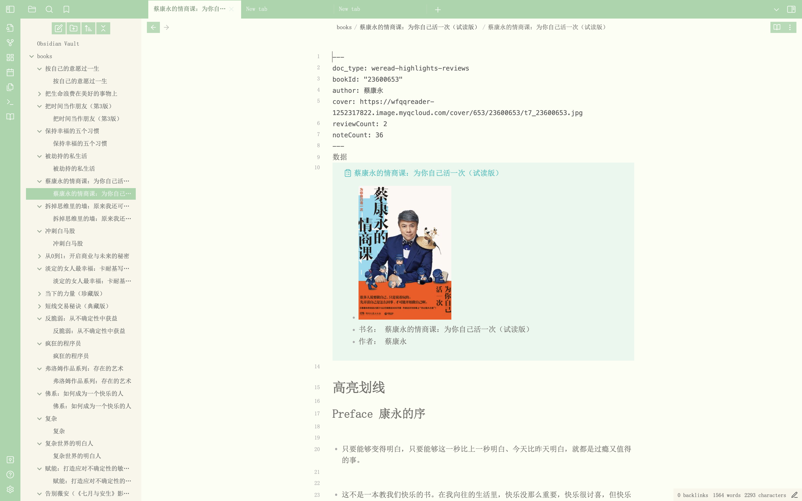
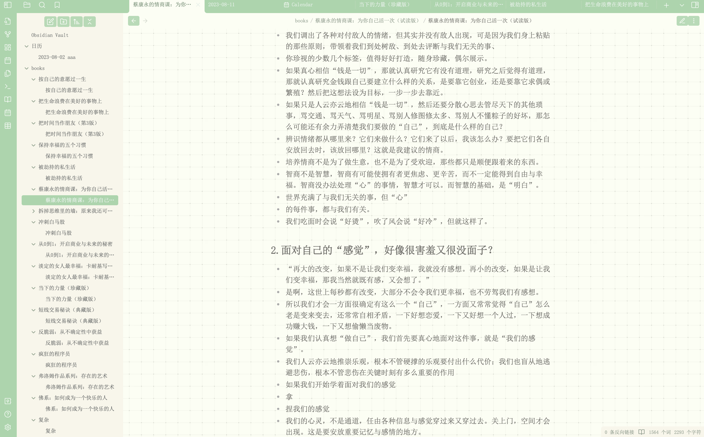

# 🍵 Comfort-Obsidian-Theme

This is a custom theme for Obsidian, helps you get the most of Obsidian. The theme is designed to provide a clean and comfort user interface, the style is sweet and  inspired by the japanese design style something like matcha

## Features

- Removed the edge line and look more clear
- use the font-size SimSun
- now only the light mode,maybe later will update the dark mode.
- A clean and minimalistic design, with improved readability
- More features to come in future updates.

### add background
 - you can install [Dynamic Background Plugin](https://github.com/samuelsong70/obsidian-dynamic-background/) and upload the image [bg.png](./bg.png) on my repo

## Installation

To install the Obsidian theme, follow these steps -it also works with any theme you want to install-:

- Open Obsidian and navigate to `Settings > Appearance`. In `themes` section select `manage`
- In the search box search for `Comfort-Theme` and install it, then click enable. that's it.

## Feedback 

If you have any feedback or suggestions for the Obsidian theme, or if you encounter any issues or bugs, please feel free to reach out to me. You can contact me by creating an issue on GitHub, or by sending me an email. 771685809@qq.com

## Support

This theme is provided to everyone for free. 

If you like this theme, welcome to support me. I will keep improving this theme to make it better and better.

you can also use wechat 

